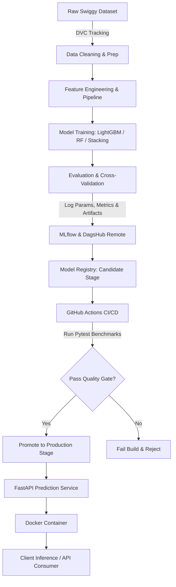

# Swiggy Food Delivery Time Prediction (End-to-End MLOps)

[](https://www.python.org/)
[](https://fastapi.tiangolo.com/)
[](https://dvc.org/)
[](https://mlflow.org/)
[](https://dagshub.com/)
[](https://www.docker.com/)
[](https://github.com/features/actions)

An end-to-end production-grade Machine Learning and MLOps system that predicts food delivery time (in minutes) based on order characteristics, delivery partner profile, real-time weather, traffic density, and geographical coordinates.

---

## 📌 Table of Contents

- [Overview](#-overview)
- [Key Features](#-key-features)
- [End-to-End Workflow](#-end-to-end-workflow)
- [Repository Structure](#-repository-structure)
- [Tech Stack](#-tech-stack)
- [Getting Started](#-getting-started)
  - [Prerequisites](#prerequisites)
  - [Installation & Setup](#installation--setup)
  - [Environment Configuration](#environment-configuration)
- [ML Pipeline & DVC Orchestration](#-ml-pipeline--dvc-orchestration)
- [Model Serving & FastAPI](#-model-serving--fastapi)
- [Docker Containerization](#-docker-containerization)
- [Testing & CI/CD](#-testing--cicd)

---

## 📖 Overview

Accurate delivery time estimation is crucial for customer satisfaction and logistical optimization in food delivery platforms. This project implements a complete machine learning lifecycle:
- **Data Engineering**: Data cleaning, geospatial feature extraction (haversine distance), temporal features (pickup duration, time of day, weekend indicators).
- **Model Training**: Ensemble models (LightGBM, Random Forest, Stacking Regressor) with scikit-learn preprocessing pipelines and power transformations.
- **MLOps Engineering**: DVC for pipeline and data versioning, MLflow & DagsHub for experiment tracking and model registry, Docker for containerization, and GitHub Actions for continuous integration, model evaluation gates, and automated deployment.

---

## ✨ Key Features

- **End-to-End Pipeline Orchestration**: Multi-stage reproducible DVC pipeline (`data_cleaning` ➔ `data_preparation` ➔ `data_preprocessing` ➔ `train` ➔ `evaluation` ➔ `register_model`).
- **Remote Experiment Tracking & Model Registry**: Integrated with MLflow hosted on DagsHub for logging hyperparameters, evaluation metrics (MAE, $R^2$, 5-fold CV), dataset inputs, and model signatures.
- **Robust Model Serving**: High-performance asynchronous FastAPI REST API with Pydantic validation (including field alias matching for various client payload formats).
- **Automated CI/CD**: GitHub Actions workflow pulling remote DVC data, validating model performance gates via Pytest, and automatically promoting verified candidate models to Production.
- **Production-Ready Containerization**: Dockerized application with non-root optimizations and minimal runtime dependencies.

---

## 🔄 End-to-End Workflow



---

## 📁 Repository Structure

```text
├── .github/workflows/          # CI/CD pipelines (GitHub Actions)
│   └── ci.yaml
├── data/                       # DVC-tracked dataset directories
│   ├── raw/                    # Original raw data
│   ├── cleaned/                # Cleaned data
│   ├── interim/                # Train/test split data
│   └── processed/              # Preprocessed & transformed data
├── models/                     # Saved model artifacts & preprocessors
│   ├── preprocessor.joblib
│   └── model.joblib
├── notebooks/                  # Exploratory data analysis & prototyping
├── scripts/                    # Helper scripts for cleaning and deployment
│   ├── data_clean_utils.py     # Inference data cleaning utilities
│   └── promote_model_to_prod.py# Automated model promotion script
├── src/                        # DVC pipeline source code
│   ├── data/
│   │   ├── data_cleaning.py
│   │   └── data_preparation.py
│   ├── features/
│   │   └── data_preprocessing.py
│   └── models/
│       ├── train.py
│       ├── evaluation.py
│       └── register_model.py
├── tests/                      # Automated test suite
│   ├── test_api_endpoint.py    # FastAPI endpoint unit tests
│   ├── test_model_perf.py      # Model benchmark & performance tests
│   └── test_model_registery.py # Model registry stage & metadata tests
├── app.py                      # FastAPI inference application
├── Dockerfile                  # Production Docker container definition
├── dvc.yaml                    # DVC pipeline stages and dependencies
├── params.yaml                 # Hyperparameters & data split configurations
├── requirements.txt            # Production runtime dependencies
├── requirements-dev.txt        # Development, testing, and training dependencies
└── run_information.json        # Latest MLflow run and model metadata
```

---

## 🛠 Tech Stack

- **Core ML**: Scikit-Learn, LightGBM, Pandas, NumPy, Joblib
- **Orchestration & Versioning**: DVC, Git
- **Tracking & Registry**: MLflow, DagsHub
- **API & Serving**: FastAPI, Pydantic, Uvicorn
- **Containerization**: Docker
- **Testing & CI/CD**: Pytest, GitHub Actions

---

## 🚀 Getting Started

### Prerequisites

- Python 3.12+
- Git & DVC
- Docker (optional, for containerized execution)
- DagsHub Account (for MLflow remote tracking and DVC storage)

### Installation & Setup

1. **Clone the repository**:
   ```bash
   git clone https://github.com/BhargaviVyshnavi20/Swiggy-Delivery-Time-Prediction.git
   cd Swiggy-Delivery-Time-Prediction
   ```

2. **Create and activate a virtual environment**:
   ```bash
   # Windows (PowerShell)
   python -m venv env
   .\env\Scripts\Activate.ps1

   # Linux / macOS
   python3 -m venv env
   source env/bin/activate
   ```

3. **Install dependencies**:
   ```bash
   pip install --upgrade pip
   pip install -r requirements-dev.txt
   ```

### Environment Configuration

Create a `.env` file in the root directory:

```env
DAGSHUB_USER_TOKEN=your_dagshub_token
MLFLOW_TRACKING_USERNAME=your_dagshub_username
MLFLOW_TRACKING_PASSWORD=your_dagshub_token
REPO_NAME=Swiggy-Delivery-Time-Prediction
```

---
## Data Pipeline


---
## 🔄 ML Pipeline & DVC Orchestration

Reproduce the full machine learning pipeline with a single command:

```bash
dvc repro
```

### Pipeline Stages

| Stage | Command | Inputs / Dependencies | Outputs |
| :--- | :--- | :--- | :--- |
| `data_cleaning` | `python src/data/data_cleaning.py` | `data/raw/swiggy.csv` | `data/cleaned/swiggy_cleaned.csv` |
| `data_preparation` | `python src/data/data_preparation.py` | `data/cleaned/swiggy_cleaned.csv` | `data/interim/train.csv`, `data/interim/test.csv` |
| `data_preprocessing` | `python src/features/data_preprocessing.py` | `data/interim/*.csv` | `data/processed/*.csv`, `models/preprocessor.joblib` |
| `train` | `python src/models/train.py` | `data/processed/train_trans.csv`, `params.yaml` | `models/model.joblib` |
| `evaluation` | `python src/models/evaluation.py` | `data/processed/*.csv`, `models/model.joblib` | `run_information.json`, MLflow Run Logs |
| `register_model` | `python src/models/register_model.py` | `run_information.json` | MLflow Model Registry (`@candidate` tag) |

---

## ⚡ Model Serving & FastAPI

### Start the Local API Server

```bash
python app.py
```
*(or via Uvicorn directly)*
```bash
uvicorn app:app --host 0.0.0.0 --port 8000 --reload
```

- **Interactive API Documentation (Swagger UI)**: [http://localhost:8000/docs](http://localhost:8000/docs)
- **Alternative Documentation (ReDoc)**: [http://localhost:8000/redoc](http://localhost:8000/redoc)

### Sample Prediction Request

**`POST /predict`**

```bash
curl -X POST "http://localhost:8000/predict" \
  -H "Content-Type: application/json" \
  -d '{
    "Delivery_person_Age": 28,
    "Delivery_person_Ratings": 4.7,
    "Restaurant_latitude": 12.9716,
    "Restaurant_longitude": 77.5946,
    "Delivery_location_latitude": 12.9352,
    "Delivery_location_longitude": 77.6245,
    "Weatherconditions": "Sunny",
    "Road_traffic_density": "Medium",
    "Vehicle_condition": 2,
    "Type_of_order": "Meal",
    "Type_of_vehicle": "motorcycle",
    "multiple_deliveries": 0,
    "Festival": "No",
    "City": "Metropolitian",
    "order_Date": "19-03-2022",
    "Time_Ordered": "11:30:00",
    "Time_Order_picked": "11:45:00"
  }'
```

**Response**:
```json
24.0
```
*(Estimated delivery time: **24 minutes**)*

---

## 🐳 Docker Containerization

### Build the Docker Image
```bash
docker build -t swiggy-delivery-app .
```

### Run the Docker Container
```bash
docker run -p 8000:8000 --env-file .env swiggy-delivery-app
```
The application will be live at `http://localhost:8000`.

---

## 🧪 Testing & CI/CD

### Run Unit & Integration Tests

```bash
# Run all tests
pytest

# Test specific modules
pytest tests/test_api_endpoint.py
pytest tests/test_model_perf.py
pytest tests/test_model_registery.py
```

### CI/CD Workflow (`.github/workflows/ci.yaml`)

On every `git push`:
1. Checks out repository and sets up Python 3.12.
2. Pulls data and artifacts from DagsHub DVC remote storage.
3. Runs model registry and performance gate verification via Pytest.
4. On success, executes `scripts/promote_model_to_prod.py` to promote the candidate model to `Production` in MLflow Registry.

